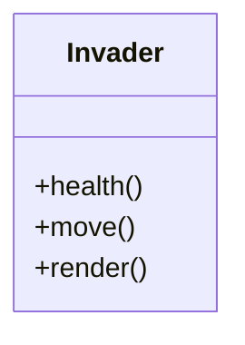
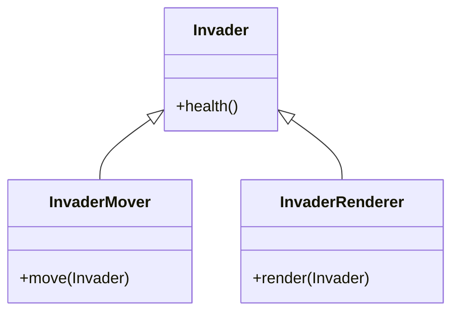
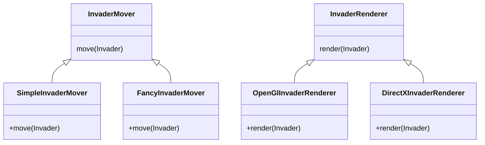
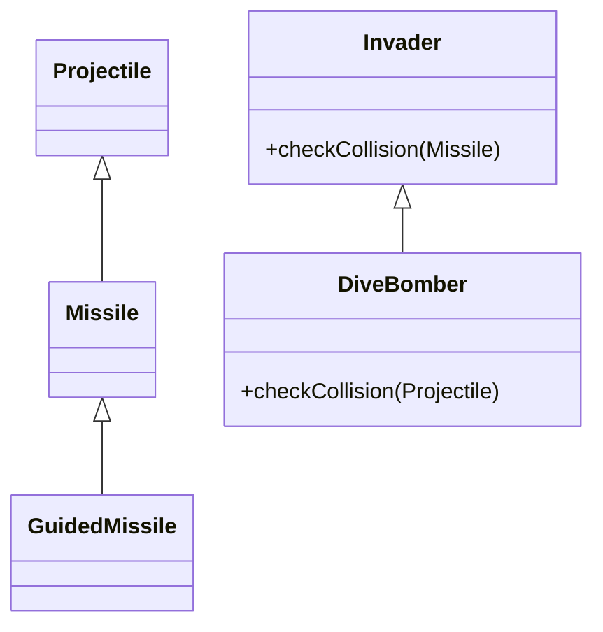
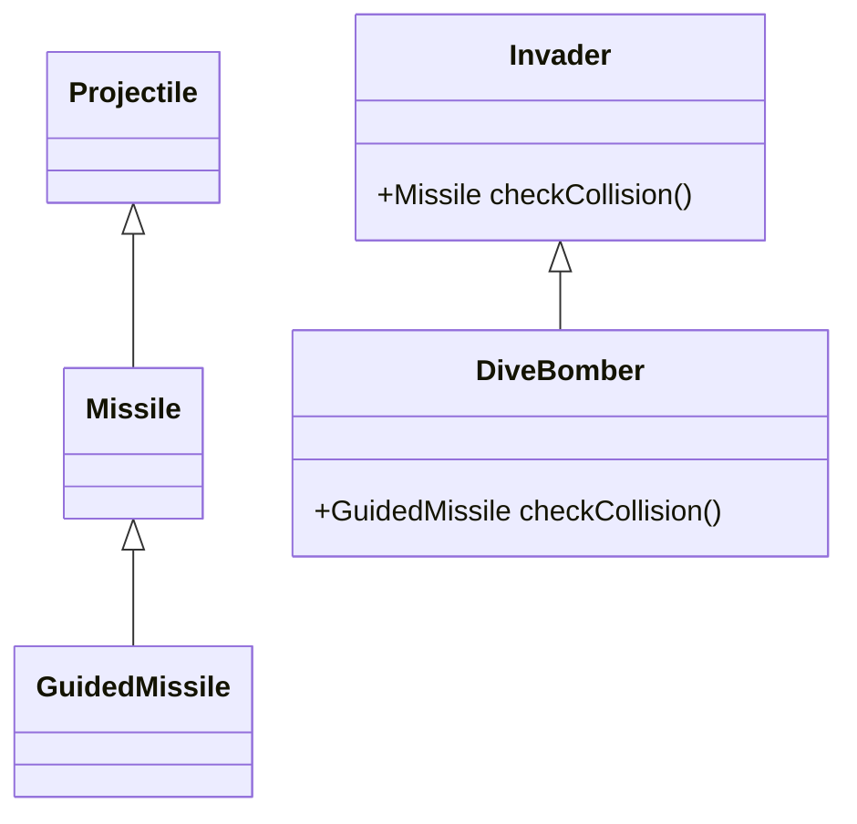

<div class="absolute top-10">
  <p>
    Lukasz Kokot & Anne-Marie Nault | <Today />
  </p>
</div>

<div class="absolute bottom-10">
  <h1 class="font-700">Clean Code</h1>
  <p>A Philosophy of Software Craftsmanship</p>
</div>

<!--
The last comment block of each slide will be treated as slide notes. It will be visible and editable in Presenter Mode along with the slide. [Read more in the docs](https://sli.dev/guide/syntax.html#notes)
-->

---
layout: presenter
firstPresenterImage: ./lukasz_avatar.jpg
secondPresenterImage: ./avatar.jpg
---
::title::
# Who are we?
::first::
### Lukasz Kokot
Chief Technological Officer & Senior Cloud Developer at Kumojin

::second::
### Anne-Marie Nault
Fullstack Developer at Kumojin & Le Wagon Montréal alumnus

---
layout: new-section
image: /intro_invader.jpg
---

# SOLID
The First 5 Principles of Object Oriented Design Explained


<!--
- Principles defined by Robert C. Martin (Uncle Bob) in 2000
- Acronym introduced by Michael Feathers
- Apply to any object-oriented design but also software component or microservices
-->

---
layout: text-image
media: /single_responsibility_principle.jpg
---

# Single Responsibility Principle (SRP)

> There should never be more than one reason for a class to change

- Easier to understand
- Less risk to break unrelated code
- Ask yourself: what is the responsibility of my component?

---

# Single Responsibility Principle
### Example: SRP broken



Several reasons to change:
- change the logic that calculate the health
- move a different way
- change the rendering

---

# Single Responsibility Principle
### Example: SRP fixed



Single reason for `Invader` to change: logic that calculates the health

---
layout: text-image
media: /openclosed_principle.jpg
---

# Open/Closed Principle (OCP)

> Software entities [...] should be open for extension, but closed for modification.

<mdi-alert /> OCP is **not** about

- locking down your class by using the correct modifiers

OCP is about:
- programming to the superclass/interface
- ensuring that we always refer to abstraction and not concrete implementation

---
layout: text-window
---

# Open/Closed Principle
### Example: OCP broken
::window::
```ruby
class InvaderAttack
  attr_reader :invaders

  def initialize(invaders)
    @invaders = invaders
  end

  def main_loop
    invaders.each do |invader|
      SimpleInvaderMover.new.move(invader);
      OpenGlInvaderRenderer.new.render(invader);
    end
  end
end

InvaderAttack.new([Invader.new])
```
---
layout: text-window
---

# Open/Closed Principle
### Example: OCP broken

- Depending on concrete implementation of `SimpleInvaderMover` and `OpenGlInvaderRenderer`
- If we need to change them, we need to change `InvaderAttack` directly

::window::
```ruby{10-11}
class InvaderAttack
  attr_reader :invaders

  def initialize(invaders)
    @invaders = invaders
  end

  def main_loop
    invaders.each do |invader|
      SimpleInvaderMover.new.move(invader);
      OpenGlInvaderRenderer.new.render(invader);
    end
  end
end

InvaderAttack.new([Invader.new])
```
<!--
Invader Attack shouldn't know about SimpleInvaderMover and OpenGLInvaderRenderer. It currently depends on them directly. What if we want to have more than one option for movers and renderers?
-->

---

# Open/Closed Principle
### Example: OCP fixed



<!--
We now have new options for movers and renderers, and these classes inherit from the parent classes Mover and Renderer, which have a move() and render() methods respectively. You can further specify their own move() and render() methods.
-->

---
layout: text-window
---

# Open/Closed Principle
### Example: OCP fixed

- **Closed for modification**: no need to modify directly `InvaderAttack`
- **Open for extension**: we can inject new implementation at runtime

::window::
```ruby{6,7,12,13}
class InvaderAttack
  attr_reader :invaders, :mover, :renderer

  def initialize(invaders, mover, renderer)
    @invaders = invaders
    @mover = mover
    @renderer = renderer
  end

  def main_loop
    invaders.each do |invader|
      mover.move(invader)
      renderer.render(invader)
    end
  end
end
```
<!--
Here, InvaderAttack takes a mover and renderer, but it doesn't know about their specific implementation, other than they have a move() or render() method. We'll see this example again with Dependency Inversion Principle
-->

---
layout: text-image
media: /liskov_substitution_principle.jpg
---

# Liskov Substitution Principle (LSP)

> Functions that use pointers or references to base classes must be able to use objects of derived classes without knowing it.

- Replacing a type by its subtype will not break a program
- Must respect 3 rules:
  - Same methods signatures
  - Same methods conditions
  - Same class properties rules

---
layout: text-2cols
---

# Liskov Substitution Principle
### Method Signature Rules: Contravariance of Arguments

- A subclass implementing a method of its superclass must have the same number of parameters.
- The type of each parameter in the subclass must be **the same or a supertype** of the type used in the respective parameter in the superclass method.

::right::


---
layout: text-2cols
---

# Liskov Substitution Principle
### Method Signature Rules: Covariance of Result

- Either both the subclass and superclass methods return a result, or they don’t.
- When they do return a result, the subclass method must return **the same type or a subtype** of the result returned by the superclass method.

::right::


---
layout: text-window
---

# Liskov Substitution Principle
### Method Signature Rules: Exception Rule Broken

- Any exceptions thrown by a subclass method should be **the same, or a subtype** of the exception thrown by the respective superclass method.

::window::
```ruby
class GraphicsException < RuntimeException; end

class OpenGlException < RuntimeException; end

class InvaderAttack
  def draw
      raise GraphicsException.new
  end
end

class FancyInvaderAttack < InvaderAttack
  def draw
    raise OpenGlException.new
  end
end
```

---
layout: text-window
---

# Liskov Substitution Principle
### Method Signature Rules: Exception Rule Fixed
::window::
```ruby{3}
class GraphicsException < RuntimeException; end

class OpenGlException < GraphicsException; end

class InvaderAttack
  def draw
      raise GraphicsException.new
  end
end

class FancyInvaderAttack < InvaderAttack
  def draw
    raise OpenGlException.new
  end
end
```

---
layout: text-window
---

# Liskov Substitution Principle
### Method Condition Rules: pre-condition rule

- The **pre-conditions** required by subclass methods **must not be stronger** than the pre-conditions required by the respective superclass method.

::window::
```ruby{3,13}
class Invader
  def check_collision(missile)
    if missile.nil?
      false
    else
      missile.intersects(self)
    end
  end
end

class DiveBomber < Invader
  def check_collision(missile)
    if missile.active?
      missile.intersects(self)
    else
      false
    end
  end
end
```

---
layout: text-window
---

# Liskov Substitution Principle
### Method Condition Rules: post-condition rule

- The **post-conditions** guaranteed by subclass methods **must not be weaker** than the post-conditions guaranteed by the respective superclass method.

::window::
```ruby{4,6,20,22}
class Invader
  def check_collision(missile)
    if missile.nil?
      dummy_missile
    else
      missile.intersects(self) ? missile : dummy_missile
    end
  end

  private

  def dummy_missile
    Missile.new
  end
end

class DiveBomber < Invader {
  def check_collision(missile)
    if missile.active?
      missile.intersects(self) ? missile : nil
    else
      nil
    end
  end
}
```

---
layout: text-window
---

# Liskov Substitution Principle
### Class Property rules: Invariant Rule

- Any invariants guaranteed by a superclass must also be guaranteed by its subclass

::window::
```ruby{8,14}
class InvaderAttack
  def initialize(max_invaders)
    @max_invaders = max_invaders;
    @invaders = []
  end

  def add(invader)
    @invaders << invader if invaders.size < @max_invaders
  end
end

class SuperInvaderAttack < InvaderAttack {
  def add(invader)
    @invaders << invader
  end
end
```

---
layout: text-window
---

# Liskov Substitution Principle
### Class Property rules: Constraint Rule

- Constraints adhered to by a superclass must be adhered to by its subclasses.

::window::
```ruby
class Invader
  attr_reader :strength

  def initialize(strength)
    @strength = strength
  end   
end

class DiveBomber < Invader 
  def set_strength(strength)
    @strength = strength;
  end
end
```

---
layout: text-image
media: /interface_segregation_principle.jpg
---

# Interface Segregation Principle (ISP)

> Many client-specific interfaces are better than one general-purpose interface.

- No client should depend on methods it does not use

---
layout: text-window
---

# Interface Segregation Principle
### Example: ISP broken

::window::
```ruby
class Invader
  def bomb(target, swoop)
    target.destroy
    puts "*swoop swoop*" if swoop
  end
end

class Bomber
  def attack
    Invader.new.bomb(user, false)
  end
end

class Swooper
  def attack
    Invader.new.bomb(user, true)
  end
end
```

<!--
Printing "swoop swoop" is only relevant when dealing with a Swooper, so here we have to pass a boolean to indicate if we want to use it or not. That violates the rule that clients should not be forced to depend upon interfaces that they don't use.
-->

---
layout: text-window
---

# Interface Segregation Principle
### Example: ISP fixed

::window::
```ruby
class InvaderAttack
  def bomb(target)
    target.destroy
  end

  def swoop
    puts "*swoop swoop*"
  end
end

class Swooper
  def attack
    invader.bomb(user)
    invader.swoop
  end

  private

  def invader
    InvaderAttack.new
  end
end
```

---
layout: text-image
media: /dependency_inversion_principle.jpg
---

# Dependency Inversion Principle (DIP)

> Depend upon abstractions, [not] concretions.

- Closely tied to Open/Closed Principle
- DIP enables OCP

---
layout: text-window
---

# Dependency Inversion Principle (DIP)
### Example

- We use Inversion of Control (IOC) to inject concrete implementations
- You can either do it manually or use Dependency Injection Frameworks

::window::
```ruby{18,19,20,21,22}
class InvaderAttack
  attr_reader :invaders, :mover, :renderer

  def initialize(invaders, mover, renderer)
    @invaders = invaders
    @mover = mover
    @renderer = renderer
  end

  def main_loop
    invaders.each do |invader|
      mover.move(invader)
      renderer.render(invader)
    end
  end
end

InvaderAttack.new(
  [Invader.new],
  SimpleInvaderMover.new,
  DirectXInvaderRenderer.new
  )
```

<!--
Coming back to the example we talked about in the Open Closed principle, we see here how we instantiate the mover and renderer outside the InvaderAttack class
-->

---
layout: default
---

# Learn more

- [SOLID Software Principles in Practice](https://www.jkspad.com/solid/solid/)
- [Single Responsibility Principe (PDF)](https://web.archive.org/web/20150202200348/http://www.objectmentor.com/resources/articles/srp.pdf)
- [Open/Closed Principle (PDF)](https://web.archive.org/web/20150905081105/http://www.objectmentor.com/resources/articles/ocp.pdf)
- [Liskov Substitution Principle (PDF)](https://web.archive.org/web/20150905081111/http://www.objectmentor.com/resources/articles/lsp.pdf)
- [Interface Segregation Principle (PDF)](https://web.archive.org/web/20150905081110/http://www.objectmentor.com/resources/articles/isp.pdf)
- [Dependency Inversion Principle (PDF)](https://web.archive.org/web/20150905081103/http://www.objectmentor.com/resources/articles/dip.pdf)

---
