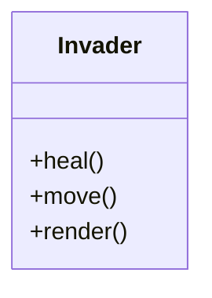
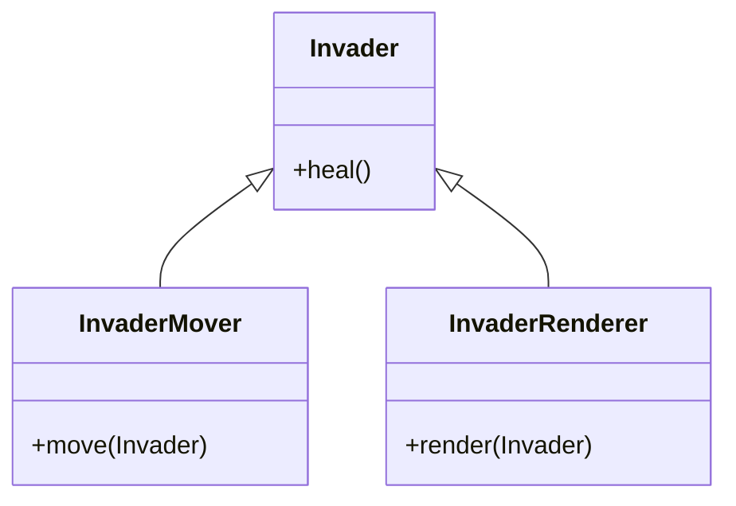
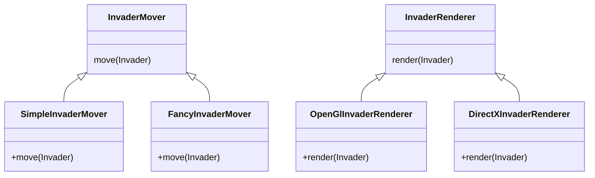
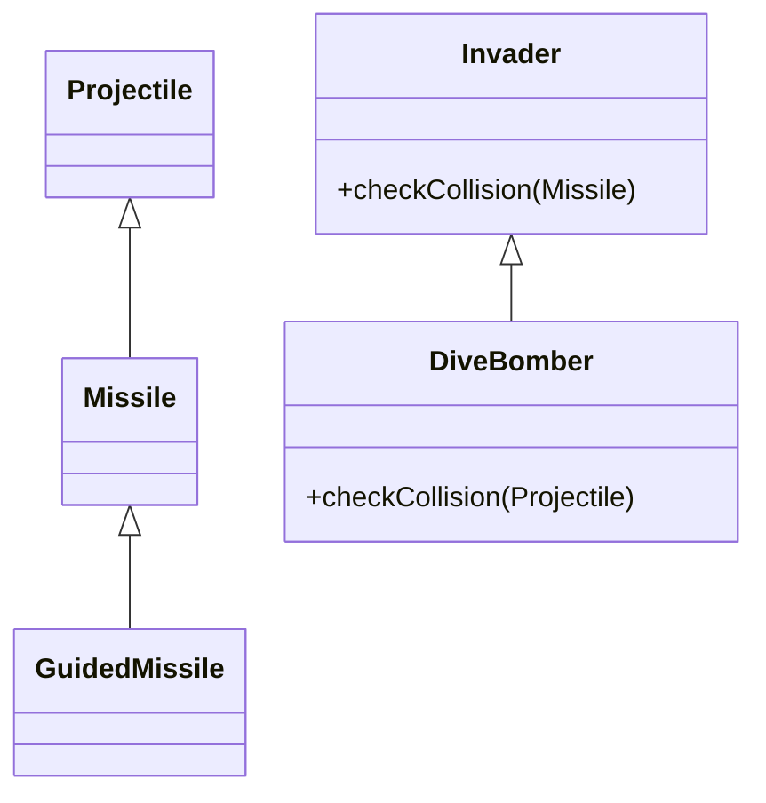
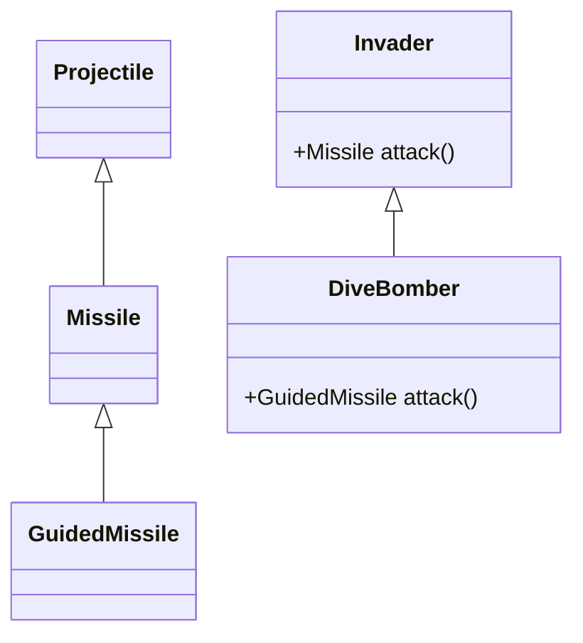

<div class="absolute top-10">
  <p>
    Lukasz Kokot & Anne-Marie Nault | <Today />
  </p>
</div>

<div class="absolute bottom-10">
  <h1 class="font-700">Clean Code</h1>
  <p>A Philosophy of Software Craftsmanship</p>
</div>

<!--
Congrats, you have completed Le Wagon's coding bootcamp! But then... what's next?
-->

---
layout: presenter
firstPresenterImage: ./lukasz_avatar.jpg
secondPresenterImage: ./avatar.jpg
---
::title::
# Who are we?
::first::
### Lukasz Kokot
Co-Founder, Chief Technological Officer & Senior Cloud Developer at Kumojin

::second::
### Anne-Marie Nault
Full Stack Developer at Kumojin & Le Wagon Montréal alumna

---
layout: text-image
media: /clean_code.jpg
---

# What is Clean Code?
> Even bad code can function. But if code isn’t clean, it can bring a development organization to its knees

- Philosophy best summed up in this handbook by **Robert C. Martin, aka "Uncle Bob"**
- Principles, patterns, and practices of writing readable, scalable and testable code
- **SOLID, DRY, KISS, Law of Demeter** and **YAGNI** are some of these principles

---
layout: new-section
---

# SOLID
The First 5 Principles of Object Oriented Design


<!--
- Principles defined by Robert C. Martin (Uncle Bob) in 2000
- Acronym introduced by Michael Feathers
- Apply to any object-oriented design but also software component or microservices
-->

---
layout: text-image
media: /single_responsibility_principle.jpg
---

# Single Responsibility Principle (SRP)

> There should never be more than one reason for a class to change

- Easier to understand
- Less risk to break unrelated code
- Ask yourself: what is the responsibility of my component?

---

# Single Responsibility Principle
### Example: SRP broken



Several reasons to change:
- change the logic that calculate the health
- move different ways
- change the rendering service

<!--
This code does work, but you have to think that your program will grow, needs will change, and your code needs to be scalable.
-->
---

# Single Responsibility Principle
### Example: SRP fixed



Single reason for `Invader` to change: logic that handles the healing process

---
layout: text-image
media: /openclosed_principle.jpg
---

# Open/Closed Principle (OCP)

> Software entities [...] should be open for extension, but closed for modification.


- You must expect that your project will change over time as new needs arise

- You should be able to change/add behavior without having to change the entity itself

---
layout: text-window
---

# Open/Closed Principle
### Example: OCP broken
::window::
```ruby
class InvaderAttack
  attr_reader :invaders

  def initialize(invaders)
    @invaders = invaders
  end

  def main_loop
    invaders.each do |invader|
      InvaderMover.new.move(invader);
      InvaderRenderer.new.render(invader);
    end
  end
end
```
---
layout: text-window
---

# Open/Closed Principle
### Example: OCP broken

- Depending on concrete implementation of `InvaderMover` and `InvaderRenderer`
- If we need to change them, have different ways to move and render, we need to change `InvaderAttack` directly

::window::
```ruby{10-11}
class InvaderAttack
  attr_reader :invaders

  def initialize(invaders)
    @invaders = invaders
  end

  def main_loop
    invaders.each do |invader|
      InvaderMover.new.move(invader);
      InvaderRenderer.new.render(invader);
    end
  end
end
```
<!--
Invader Attack shouldn't know about InvaderMover and InvaderRenderer. It currently depends on them directly. What if we want to have more than one option for movers and renderers?
-->

---

# Open/Closed Principle
### Example: OCP fixed



<!--
We now have new options for movers and renderers, and these classes inherit from the parent classes Mover and Renderer, which have a move() and render() methods respectively. You can further specify their own move() and render() methods.
-->

---
layout: text-window
---

# Open/Closed Principle
### Example: OCP fixed

- **Closed for modification**: no need to modify directly `InvaderAttack`
- **Open for extension**: we can inject new implementation at runtime

::window::
```ruby{6,7,12,13}
class InvaderAttack
  attr_reader :invaders, :mover, :renderer

  def initialize(invaders, mover, renderer)
    @invaders = invaders
    @mover = mover
    @renderer = renderer
  end

  def main_loop
    invaders.each do |invader|
      mover.move(invader)
      renderer.render(invader)
    end
  end
end
```
<!--
Here, InvaderAttack takes a mover and renderer, but it doesn't know about their specific implementation, other than they have a move() or render() method. We'll see this example again with Dependency Inversion Principle (D)
Note that it remains a bit risky with Ruby, because it doesn't check if the mover and renderer that you pass in the initialize method is of the right type. This is something that typed languages, like Typescript, would support in reducing chances of errors.
-->

---
layout: text-image
media: /liskov_substitution_principle.jpg
---

# Liskov Substitution Principle (LSP)

> Functions that use pointers or references to base classes must be able to use objects of derived classes without knowing it.

- Replacing a type by its subtype will not break a program
- Must respect 3 rules:
  - Same methods signatures
  - Same methods conditions
  - Same class properties rules

---
layout: text-2cols
---

# Liskov Substitution Principle
### Method Signature Rules: Contravariance of Arguments

- A subclass implementing a method of its superclass must have the same number of parameters.
- The type of each parameter in the subclass must be **the same or a supertype** of the type used in the respective parameter in the superclass method.

::right::


---
layout: text-2cols
---

# Liskov Substitution Principle
### Method Signature Rules: Covariance of Result

- Either both the subclass and superclass methods return a result, or they don’t.
- When they do return a result, the subclass method must return **the same type or a subtype** of the result returned by the superclass method.

::right::


---
layout: text-window
---

# Liskov Substitution Principle
### Method Signature Rules: Exception Rule Broken

- Any exceptions thrown by a subclass method should be **the same, or a subtype** of the exception thrown by the respective superclass method.

::window::
```ruby
class GraphicsException < RuntimeException; end

class OpenGlException < RuntimeException; end

class InvaderAttack
  def draw
      raise GraphicsException.new
  end
end

class FancyInvaderAttack < InvaderAttack
  def draw
    raise OpenGlException.new
  end
end
```

---
layout: text-window
---

# Liskov Substitution Principle
### Method Signature Rules: Exception Rule Fixed
::window::
```ruby{3}
class GraphicsException < RuntimeException; end

class OpenGlException < GraphicsException; end

class InvaderAttack
  def draw
      raise GraphicsException.new
  end
end

class FancyInvaderAttack < InvaderAttack
  def draw
    raise OpenGlException.new
  end
end
```

---
layout: text-window
---

# Liskov Substitution Principle
### Method Condition Rules: pre-condition rule

- The **pre-conditions** required by subclass methods **must not be stronger** than the pre-conditions required by the respective superclass method.

::window::
```ruby{3,13}
class Invader
  def check_collision(missile)
    if missile.nil?
      false
    else
      missile.intersects(self)
    end
  end
end

class DiveBomber < Invader
  def check_collision(missile)
    if missile.active?
      missile.intersects(self)
    else
      false
    end
  end
end
```

---
layout: text-window
---

# Liskov Substitution Principle
### Method Condition Rules: post-condition rule

- The **post-conditions** guaranteed by subclass methods **must not be weaker** than the post-conditions guaranteed by the respective superclass method.

::window::
```ruby{4,6,20,22}
class Invader
  def check_collision(missile)
    if missile.nil?
      dummy_missile
    else
      missile.intersects(self) ? missile : dummy_missile
    end
  end

  private

  def dummy_missile
    Missile.new
  end
end

class DiveBomber < Invader {
  def check_collision(missile)
    if missile.active?
      missile.intersects(self) ? missile : nil
    else
      nil
    end
  end
}
```

---
layout: text-window
---

# Liskov Substitution Principle
### Class Property rules: Invariant Rule

- Any invariants guaranteed by a superclass must also be guaranteed by its subclass

::window::
```ruby{1,3,4,8,9,14,16}
class InvaderAttack
  def initialize(max_invaders)
    @max_invaders = max_invaders;
    @invaders = []
  end

  def add(invader)
    if invaders.size < @max_invaders
      @invaders << invader
    end
  end
end

class SuperInvaderAttack < InvaderAttack
  def add(invader)
    @invaders << invader
  end
end
```

---
layout: text-window
---

# Liskov Substitution Principle
### Class Property rules: Constraint Rule

- Constraints adhered to by a superclass must be adhered to by its subclasses.

::window::
```ruby{2,9,10}
class Invader
  attr_reader :strength

  def initialize(strength)
    @strength = strength
  end   
end

class DiveBomber < Invader 
  def set_strength(strength)
    @strength = strength;
  end
end
```

---
layout: text-image
media: /interface_segregation_principle.jpg
---

# Interface Segregation Principle (ISP)

> Many client-specific interfaces are better than one general-purpose interface.

- No client should depend on methods it does not use

---
layout: text-window
---

# Interface Segregation Principle
### Example: ISP broken

::window::
```ruby
class Invader
  def bomb(target, swoop)
    target.destroy
    puts "*swoop swoop*" if swoop
  end
end

class Bomber
  def attack(target)
    Invader.new.bomb(target, false)
  end
end

class Swooper
  def attack(target)
    Invader.new.bomb(target, true)
  end
end
```

<!--
Printing "swoop swoop" is only relevant when dealing with a Swooper, so here we have to pass a boolean to indicate if we want to use it or not. That violates the rule that clients should not be forced to depend upon interfaces that they don't use.
-->

---
layout: text-window
---

# Interface Segregation Principle
### Example: ISP fixed

::window::
```ruby
class InvaderAttack
  def bomb(target)
    target.destroy
  end

  def swoop
    puts "*swoop swoop*"
  end
end

class Swooper
  def attack(target)
    invader.bomb(target)
    invader.swoop
  end

  private

  def invader
    InvaderAttack.new
  end
end
```

---
layout: text-image
media: /dependency_inversion_principle.jpg
---

# Dependency Inversion Principle (DIP)

> Depend upon abstractions, [not] concretions.

- Closely tied to Open/Closed Principle
- DIP enables OCP

---
layout: text-window
---

# Dependency Inversion Principle (DIP)
### Example

- We use Inversion of Control (IOC) to inject concrete implementations
- You can either do it manually or use Dependency Injection Frameworks

::window::
```ruby{11,12,13,15}
class InvaderAttack
  def initialize(invaders, mover, renderer)
    @invaders = invaders
    @mover = mover
    @renderer = renderer
  end

  ...
end

invaders = [Invader.new('small'), Invader.new('medium')]
mover = SimpleInvaderMover.new
renderer = DirectXInvaderRenderer.new

InvaderAttack.new(invaders, mover, renderer)
```

<!--
Coming back to the example we talked about in the Open Closed principle, we see here how we instantiate the invaders, mover and renderer outside the InvaderAttack class
-->

---
layout: new-section
---

# DRY
Don't repeat yourself

---
layout: text-window
---

# Don't Repeat Yourself
>Every piece of knowledge must have a single, unambiguous, authoritative representation within a system

- Repeated code is harder to maintain and scale
- Very likely to encounter errors if a change in logic is needed
- You should extract common logic into their own methods/functions

::window::
```ruby
# REPEATED CODE
class InvaderAttack
 ...

  def main_loop
    invaders.each do |invader|
      mover.move(invader)
      renderer.render(invader)
    end
  end

  def special_loop
    invaders.each do |invader|
      invader.heal(10)
      mover.move(invader)
      renderer.render(invader)
    end
  end
end
```

---
layout: text-window
---

# Don't Repeat Yourself
>Every piece of knowledge must have a single, unambiguous, authoritative representation within a system

- Repeated code is harder to maintain and scale
- Very likely to encounter errors if a change in logic is needed
- You should extract common logic into their own methods/functions

::window::
```ruby
# REFACTORED
class InvaderAttack
 ...

  def main_loop
    invaders.each do |invader|
      basic_attack(invader)
    end
  end

  def special_loop
    invaders.each do |invader|
      invader.heal(10)
      basic_attack(invader)
    end
  end

  private

  def basic_attack(invader)
    mover.move(invader)
    renderer.render(invader)
  end
end
```

---
layout: new-section
---

# KISS
Keep it simple stupid

---
layout: text-window
---

# Keep it simple
>Any fool can write code that a computer can understand. Good programmers write code that humans can understand

- Code should be easy to understand and easy to maintain
- Divide your lengthy methods into short, simple pieces of logic
- Your code shouldn't need comments to explain what it does!
- Linters (like Rubocop for Ruby) will often warn you based on some metrics

::window::
```ruby
## Cyclomatic Complexity is too high

def customer_order
  if customer_id.present? && !order_id.present?
    render_error :not_found, 'Invalid customer id' \
    unless @info.customer_id == customer_id
  elsif order_id.present? && !customer_id.present?
    render_error :not_found, 'Invalid order id' \
    unless @info.order_id == order_id
  elsif customer_id.present? && order_id.present?
    render_error :not_found, 'Invalid info' \
      unless @info.customer_id == customer_id &&
              @info.order_id == order_id
  end
end
```

---
layout: new-section
---
# Law of Demeter

---
layout: text-window
---

# Law of Demeter
### Principle of least knowledge

- Keep software entities independent of each other
- Reduce the communication or coupling between different classes - "don't talk to strangers"
- Put related classes in the same package, module or directory to achieve cohesion

::window::
```ruby
class Game < ActiveRecord::Base
  belongs_to :user
end

class User < ActiveRecord::Base
  has_many :games
end

invader_game.user.username

# ⚠️WARNING⚠️ 
# INSTANCE OF GAME IS CALLING USERNAME VIA USER
```

---
layout: text-window
---

# Law of Demeter
### Principle of least knowledge

- Keep software entities independent of each other
- Reduce the communication or coupling between different classes - "don't talk to strangers"
- Put related classes in the same package, module or directory to achieve cohesion

::window::
```ruby
class Game < ActiveRecord::Base
  belongs_to :user
  delegate :username, to: :user, prefix: true
end

class User < ActiveRecord::Base
  has_many :games
end

invader_game.user_username

# 'DELEGATE' IN RAILS MAKES IT POSSIBLE
# TO CALL USERNAME DIRECTLY ON INSTANCE OF GAME
```

---
layout: new-section
---

# YAGNI
You ain't gonna need it

---
layout: text-image
media: /yagni.png
---

# You ain't gonna need it

- Implement features only when you do need it
- Avoid having to maintain code that is not being used, and might never be
- Also in line with the Agile Methodology

Do expect your code to change in the future and make sure it will be **easy to change**, but you can't predict what **exact changes** will be needed.

<!--
By following all the previous principles, you are making sure that when you DO need it, it's easy to implement in your existing code.
-->

---
layout: new-section
---

# Craftsmanship
There are two parts to learning craftsmanship: **knowledge** and **work**.

*You must gain the knowledge of principles, patterns, practices, and heuristics that a craftsman knows, and you must also grind that knowledge into your fingers, eyes, and gut by working hard and practicing.*

-- Robert C. Martin

---
layout: default
---

# Learn more
- [Clean Code: 100+ pieces of timeless advice](https://dev.to/thawkin3/in-defense-of-clean-code-100-pieces-of-timeless-advice-from-uncle-bob-5flk)
- [Practical Object-Oriented Design - An Agile Primer Using Ruby (Sandi Metz)](https://www.poodr.com/)
- [SOLID Software Principles in Practice](https://www.jkspad.com/solid/solid/)
- [SOLID Principles applied to Ruby](http://rubyblog.pro/2017/05/solid-single-responsibility-principle-by-example)


---
